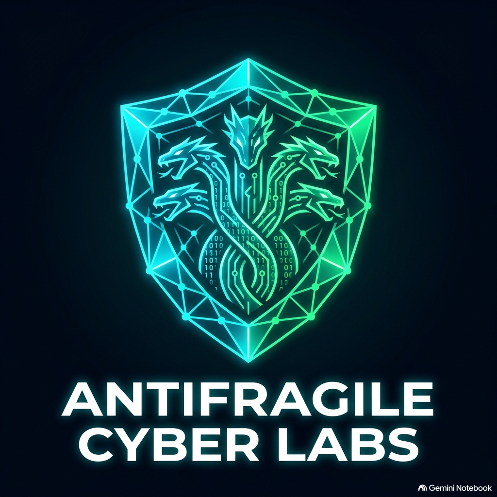

<p align="center">
  
</p>

# 🛡️ Antifragile Cyber Labs

## 📌 Descripción del Proyecto
## 📌 Descripción del Proyecto
Portal web y bitácora técnica de arquitectura de red, ciberseguridad defensiva/ofensiva y monitoreo SOC. Este proyecto fue desarrollado inicialmente para la Práctica 1 de la asignatura **Desarrollo de Aplicaciones de Red (DAR)** en la **Ingeniería en Sistemas Computacionales** de la **Universidad de La Rioja en México**. 

Al proponer esta práctica, el objetivo trascendió de una entrega de una página estática para cumplir con una calificación a una plataforma viva y evolutiva que documenta y sirve de evidencia viva del progreso real a lo largo de los **120 días de desarrollo del proyecto Antifragile Cybersecurity (de 0 a 100)** en el repositorio [antifragile-cibersecurity-labs](https://github.com/jorgerickdev/antifragile-cybersecurity-labs) se encuentra la documentacion tecnica y codigos para que accedan a las practicas.


---

## 🏗️ Filosofía de Ingeniería & Detalles Técnicos (Bare-Metal)
Con la misma filosofia del repositorio puro **Bare-Metal** a diferencia de los enfoques convencionales que recurren a plataformas de desarrollo predefinidas, creadores de sitios o plantillas comerciales (CMS como WordPress, Wix, Gatsby o Bootstrap), este sistema fue **diseñado y construido desde cero (bare-metal)**, priorizando el control total sobre la pila de tecnologías:

1. **Frontend & UI/UX Cyber Dark Nactivo:**
   * **HTML5 Semántico Estricto:** Estructura limpia y desacoplada mediante etiquetas estándar (`<header>`, `<nav>`, `<main>`, `<section>`, `<footer>`).
   * **CSS3 Modular Adaptativo:** Arquitectura de estilos sin frameworks externos, organizada en archivos independientes (`global.css`, `login.css`, `dashboard.css`, `misiones.css`) impulsados por variables CSS nativas (`:root`).
   * **JavaScript Vanilla:** Control de sesión local y validación de credenciales en cliente mediante scripts ligeros sin librerías de terceros (`login.js`).

2. **Ciberseguridad & Sockets Bare-Metal (Python Backend):**
   * **Inyección en Capa de Red y Transporte:** Desarrollo de scripts en Python utilizando **Sockets RAW (`SOCK_RAW`)** para evadir abstracciones del sistema operativo.
   * **Forjado Binario de Cabeceras (RFC 1071 / RFC 793):** Empaquetado manual byte a byte con `struct.pack` y cálculo directo de la suma de comprobación (checksum) sobre la pseudo-cabecera IP.
   * **Reconocimiento Stealth:** Implementación de técnicas **SYN Stealth (Half-Open)** con desconexión inmediata vía paquetes `RST`, y escaneo **FIN Stealth** bajo especificaciones del estándar RFC 793.

3. **Análisis Bi-direccional SOC (Red Team vs. Blue Team):**
   * Documentación de laboratorio con análisis de impacto ofensivo (evasión de firmas) y contramedidas defensivas (detección de tramas huérfanas en Stateful Firewalls e IDS/IPS).

---

## 📁 Arquitectura del Repositorio
El proyecto mantiene una estructura modular, limpia, expandible y altamente mantenible:

```text
antifragile-cybersecurity-labs/
├── login.html                   # Módulo de Autenticación de Operadores
├── dashboard.html               # Consola Central de Operaciones SOC
├── mision-01.html               # Módulo 01: Sniffer de Red (ICMP / Sockets RAW)
├── mision-02.html               # Módulo 02: Escáner Fantasma (SYN & FIN Stealth)
├── acerca.html                  # Ficha Técnica y Documentación del Sistema
├── assets/
│   ├── css/
│   │   ├── global.css           # Variables de Tema y Reglas Base
│   │   ├── login.css            # Estilos Exclusivos del Login
│   │   ├── dashboard.css        # Estilos del Panel SOC y Tarjetas
│   │   └── misiones.css         # Estilos de Terminal, Logs y Fricción SOC
│   ├── js/
│   │   └── login.js             # Lógica de Validación de Credenciales
│   └── img/                     # Recursos Gráficos, Topologías y Evidencias
└── README.md                    # Documentación Técnica del Proyecto
🚀 Bitácora y Estado del Desarrollo
[x] 17-sep: Inicialización del entorno Linux (Ubuntu) y arquitectura de directorios.
[x] 03-oct: Maquetación semántica en HTML5 de login.html, dashboard.html y acerca.html.
[x] 03-oct: Implementación de arquitectura CSS modular propia sin frameworks (global.css, login.css, dashboard.css, misiones.css).
[x] 03-oct: Lógica de interacción y simulación de sesión SOC en login.js.
[x] 03-oct: Desarrollo y documentación técnica de la Misión 01 (Sniffer de Red ICMP / Raw Sockets).
[x] 04-oct: Desarrollo, forjado de paquetes binarios y documentación de la Misión 02 (ghost_scanner.py).
[x] 04-oct: Generación e integración de diagramas de topología de laboratorio (laboratorio_fantasma.png) y capturas de ejecuciones reales.
[x] 04-oct: Integración de enlace institucional global al repositorio en el footer de todas las vistas.
[x] 04-oct: Sincronización y versión final en GitHub vía SSH (jorgerickdev/antifragile-cybersecurity-labs).
Licencia: Académica / Uso Interno SOC
Desarrollado por: Rick (jorgerickdev)

---

---